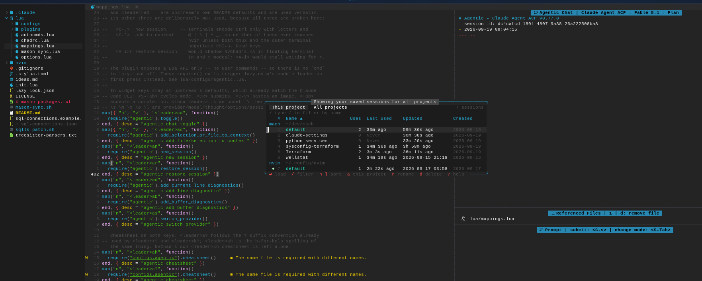

# session-mgr.nvim

Named, per-project Neovim sessions with a floating picker.

Save as many sessions per project as you like, load them from a sortable,
filterable, mouse-friendly popup, and keep a one-keystroke `default` session
for the lazy case. Sessions are keyed by **git root**, so they load from
anywhere inside the repo; every session carries a use count and
last-used / updated / created times.



```
╭────────────── Save session for work ───────────────╮   <leader>ss
│cooli.vim                                           │   the .vim is always shown, never editable
╰────────────────────────────── overwrites cooli.vim ╯   tells you before you press Enter
╭──────────────── 3 of 5 saved for work ─────────────╮
│   cool                                  3h 20m ago │   narrows as you type
│ ▌ cooli                                 4h 26m ago │   Tab cycles matches into the input
╰ ⏎ save  tab complete  esc cancel ──────────────────╯
```

## Contents

- [Requirements](#requirements)
- [Install](#install)
- [Quick start](#quick-start)
- [Commands](#commands)
- [Keymaps](#keymaps)
- [Configuration](#configuration)
- [How projects and sessions are identified](#how-projects-and-sessions-are-identified)
- [Data on disk](#data-on-disk)
- [Highlight groups](#highlight-groups)
- [Events and hooks](#events-and-hooks)
- [Troubleshooting](#troubleshooting)
- [Development](#development)

## Requirements

- Neovim **0.11+** (developed on 0.12). Uses float titles/footers, inline
  virtual text, `vim.system`, `vim.uv`, `vim.fs`.
- `git` (optional): without it every directory is its own project.
- No plugin dependencies.

## Install

This is a private repo developed in `~/dev/session-mgr.nvim`. lazy.nvim loads
that checkout directly, and only clones from GitHub (which needs
`gh auth setup-git`, because lazy runs git with prompts disabled) when the
checkout is missing.

```lua
-- lua/configs/lazy.lua  (lazy's own options)
dev = { path = "~/dev", fallback = true },   -- fallback is OFF by default in lazy

-- lua/plugins/session-mgr.lua
return {
  {
    "hosua/session-mgr.nvim",
    dev = true,
    cmd = { "SessionMgr" },   -- the load trigger; the keymaps below ride it
    opts = {},
  },
}
```

`setup()` is optional: with no call at all the plugin uses the defaults.

## Quick start

| Press | What happens |
|---|---|
| `<leader>sS` | Save this project's `default` session. No prompt, no overwrite warning. |
| `<leader>sL` | Load it. |
| `<leader>ss` | Name a session in the save popup. |
| `<leader>sl` | Pick one of this project's sessions. |
| `<leader>sa` | Pick from every project's sessions. |

After a save a toast shows the full path and how to get back:

```
Saved ~/.local/share/nvim/sessions/%home%me%dev%mach/coolio.vim
Reload with :SessionMgr load coolio  or  <leader>sl
```

The key in that message is the one **you** mapped (see [Keymaps](#keymaps)),
not a hardcoded default.

## Commands

One command, with completion for subcommands and session names.

| Command | What it does |
|---|---|
| `:SessionMgr save` | Open the save popup. |
| `:SessionMgr save {name}` | Save this project's session `{name}` (spaces allowed). Overwrites silently: you named it. |
| `:SessionMgr save!` | Save the `default` session. |
| `:SessionMgr load` | Open the picker for this project. |
| `:SessionMgr load {name}` | Load `{name}`. |
| `:SessionMgr load!` | Load the `default` session. |
| `:SessionMgr all` | Open the picker for all projects. |
| `:SessionMgr rename {old} {new}` | Rename; use count and times follow the session. Refuses to overwrite. |
| `:SessionMgr delete {name}` | Delete the file and its record. No prompt (the picker's `d` asks). |

`:SessionMgr! save` is accepted as a spelling of `:SessionMgr save!`.

**Loading replaces your workspace** (`load.replace = true`): every buffer is
wiped, then the session is sourced. If that would lose something you are
asked first, for `load!` too. `w` is not offered while an unnamed modified
buffer exists, since it could not be written:

```
╭────────────────── 2 unsaved buffers ───────────────────╮
│  M  lua/configs/session.lua                            │
│  T  term://~/dev/mach//1234:zsh  running job is killed │
│                                                        │
│  w  write all & load                                   │
│  d  discard & load                                     │
╰ q cancel ──────────────────────────────────────────────╯
```

## Keymaps

The plugin installs **no** global keymaps unless `keymaps = true`. Suggested
(this is exactly what `keymaps = true` installs):

```lua
local map = vim.keymap.set
map("n", "<leader>ss", "<cmd>SessionMgr save<cr>",  { desc = "session save as (named)" })
map("n", "<leader>sl", "<cmd>SessionMgr load<cr>",  { desc = "session load (this project)" })
map("n", "<leader>sa", "<cmd>SessionMgr all<cr>",   { desc = "session load (all projects)" })
map("n", "<leader>sS", "<cmd>SessionMgr save!<cr>", { desc = "session save default" })
map("n", "<leader>sL", "<cmd>SessionMgr load!<cr>", { desc = "session load default" })
```

Keep the right-hand side a **command string**. The plugin finds your load key
by scanning your mappings for `<cmd>SessionMgr load<cr>`; a Lua function has
no inspectable right-hand side, so messages would fall back to naming only
the command (or set `hints.load_key`).

### In the picker

| Keys | Action |
|---|---|
| `j` `k` `↓` `↑` `<C-n>` `<C-p>` | move |
| `gg` `G` `<Home>` `<End>` | first / last; `{count}G` jumps to row `#` |
| `<C-d>` `<C-u>` | half a page |
| `<PageDown>` `<PageUp>` `<C-f>` `<C-b>` | a page |
| mouse wheel | scroll |
| `l` `h` `→` `←` | next / previous sort column |
| `1` … `5` | sort by name, uses, last used, updated, created |
| `o` | reverse the order |
| click a column header | sort by it; click again to reverse |
| `a` `<Tab>`, or click a scope tab | this project ⇄ all projects |
| `/` | filter by name, live. In the filter: `<CR>` keeps it, `<Esc>` clears it, `↓` `↑` move |
| `<C-l>` | clear the filter |
| `<CR>`, double-click | load |
| click | select |
| `r` | rename |
| `d` | delete (asks; the `default` session asks twice) |
| `p` | show / hide the preview pane |
| `?` | help |
| `q` `<Esc>` | close (the first `<Esc>` clears an active filter) |

Sorting: names start A→Z; counts and dates start newest/highest first;
"Never" sorts last either way; the same column again reverses. `default` is
always first within its project. In the all-projects view sessions are
grouped by project (A→Z) and sorted within each group; `#` keeps counting
across groups. A filter matches **names only** (fzf-style, smartcase),
flattens the groups, and shows each row's project after its name; it narrows
the list while your chosen sort still orders it.

Times: `Just now` under a minute, then `5m 57s ago`, `1h 5m ago`, `1h ago`;
from one day on the local date and time, `2026-09-19 07:59`. `Created` is a
date. They refresh once a second while the picker is open.

### In the save popup

| Keys | Action |
|---|---|
| type | narrows the list; the border says `new session` or `overwrites x.vim` |
| `<Tab>` `<S-Tab>` `<C-n>` `<C-p>` `↓` `↑` | cycle the matches into the input (the list does not narrow further) |
| `<CR>` | save; an existing name asks first |
| `<Esc>` `<C-c>` | cancel |

It opens pre-filled with the active session, so re-saving is `<leader>ss`
then `<CR>`. Names may contain spaces and unicode; they may not contain `/`
or `\`, start with a dot, contain control characters, or exceed 100 bytes. A
typed `.vim` is dropped rather than doubled.

## Configuration

Every option, with its default. This block is checked against the code by a
test, so it cannot drift.

<!-- config:start -->
```lua
require("session-mgr").setup {
  -- Where sessions live: <root>/<escaped project root>/<name>.vim
  root = vim.fn.stdpath "data" .. "/sessions",
  -- The session used by `:SessionMgr save!` / `load!`. Always listed first.
  default_name = "default",
  -- Re-save the ACTIVE session on exit and before switching to another one.
  -- Never creates a session by itself.
  autosave = false,
  -- One-time, copy-only import of legacy <root>/%path%to%cwd.vim files.
  migrate_legacy = true,
  load = {
    -- true: wipe all buffers, then source (you get exactly that session).
    -- false: source on top of what is open, like a bare :source.
    replace = true,
  },
  -- 'sessionoptions' used only while saving. false = use your own setting.
  sessionoptions = { "buffers", "curdir", "folds", "help", "tabpages", "winsize", "terminal" },
  -- Windows closed before :mksession so they are not restored as empty splits.
  close_before_save = {
    filetypes = { "NvimTree", "neo-tree", "qf", "lazy", "mason", "TelescopePrompt" },
    buftypes = { "nofile", "prompt" },
  },
  -- Reopen nvim-tree after saving if it was open.
  reopen_after_save = true,
  project = {
    -- true: key sessions by the git root. false: always by the cwd.
    git_root = true,
    git_timeout_ms = 500,
  },
  picker = {
    -- false = follow 'winborder' (falls back to "rounded" when that is empty).
    border = false,
    max_width = 0.9, -- fraction of the editor
    max_height = 0.8,
    preview = true,
    preview_min_columns = 120, -- hide the preview pane below this editor width
    preview_width = 0.4, -- fraction of the picker
    mouse = true, -- click, double-click, wheel, clickable headers
    hover = true, -- highlight the row under the mouse (sets 'mousemoveevent' while open)
    refresh_ms = 1000, -- re-render relative times while open; 0 = never
    default_sort = { key = "name", dir = "asc" }, -- name|uses|last_used|updated|created
  },
  save_prompt = {
    width = 60,
    max_list_height = 10,
    prefill_active = true, -- start with the active session's name typed in
  },
  confirm = {
    delete_default_twice = true,
  },
  hints = {
    -- Key shown in "Reload with ..." messages. false = discover it from your
    -- mappings (any normal-mode map whose rhs is `<cmd>SessionMgr load<cr>`).
    load_key = false,
  },
  hooks = {
    -- Each is false or function(ctx) with ctx = { project, name, file }.
    pre_save = false,
    post_save = false,
    pre_load = false,
    post_load = false,
  },
  -- true: install <leader>ss / sl / sa / sS / sL.
  keymaps = false,
  -- false silences success messages; warnings and errors always show.
  notify = true,
  -- true: messages appear in a small self-closing float (top right) instead of
  -- vim.notify, whose two-line save message would stop at "Press ENTER".
  toast = true,
}
```
<!-- config:end -->

Unknown keys, wrong types, fractions outside `(0, 1]` and unknown sort keys
are reported in one warning that names the option (`picker.previw`), and the
default is used.

### A sample configuration

```lua
{
  "hosua/session-mgr.nvim",
  dev = true,
  cmd = { "SessionMgr" },
  opts = {
    autosave = true,                       -- keep the active session current on exit / switch
    load = { replace = true },
    picker = {
      border = "single",
      preview_min_columns = 140,           -- I only want the preview on the big monitor
      default_sort = { key = "last_used", dir = "desc" },
      refresh_ms = 0,                      -- no ticking clock
    },
    save_prompt = { width = 72, max_list_height = 15 },
    hooks = {
      pre_save = function(ctx)             -- ctx = { project, name, file }
        pcall(vim.cmd, "cclose")
      end,
    },
  },
}
```

## How projects and sessions are identified

- A **project** is the git top level of the current directory
  (`git rev-parse --show-toplevel`), or the current directory itself outside
  git (or with `project.git_root = false`). `<leader>sl` in
  `~/dev/mach/sysconfig/terraform` and in `~/dev/mach` list the same sessions.
- Projects are keyed by their **full path**, never by folder name, so two
  folders called `build` never share sessions. The picker shows the folder
  name plus a shortened path (`~/path/to/long…/projectA`).
- Outside git a project is just "this folder": `<leader>sl` only lists it
  from there, and the picker says so. `<leader>sa` lists and loads it from
  anywhere, because each session restores its own directory (`curdir`).
- Each git **worktree** is its own project. That is deliberate: its files
  live at different paths.
- The **active session** is the one this Neovim instance last saved or
  loaded. It is marked `●`, pre-fills the save popup, and is what `autosave`
  re-saves. It is per instance and not stored.

## Data on disk

```
~/.local/share/nvim/sessions/                 root  (stdpath("data") .. "/sessions")
  %home%me%dev%mach/                          one directory per project: its path, / \ : -> %
    default.vim                               ordinary :mksession files
    sysconfig-terraform.vim
    index.json                                metrics for this project
  .migrated-legacy-v1.json                    what the one-time import did
  %home%me%dev%mach.vim                       legacy file, left untouched
```

`index.json`:

```json
{ "version": 1, "root": "/home/me/dev/mach", "label": "mach", "is_git": true,
  "sessions": { "default": { "uses": 3, "created": 1789800000, "updated": 1789816000, "last_used": 1789815000 } } }
```

- Times are epoch seconds. `uses` counts loads. `updated` is the last save
  (always set); `last_used` is the last load (absent until the first one).
- One index per project, written via a temp file and a rename, so two Neovim
  instances never see a half-written file. The files on disk are the truth:
  a `.vim` without a record is adopted from its mtime, a record without a
  file is dropped. Deleting a `.vim` by hand is safe.
- A corrupt `index.json` is moved to `index.json.corrupt-<time>` and rebuilt.
  An index with a newer `version` is never written to.
- Project directory names longer than 200 bytes are truncated and given a
  hash suffix. They are never decoded back into paths; the real path is in
  `index.json`.
- A session file is Vimscript. The plugin only ever sources a file whose
  resolved path is inside `root`, so a symlink cannot point it elsewhere.

**Legacy import.** Session files of the form `<root>/%path%to%cwd.vim` (from
a hand-rolled `:mksession` mapping) are **copied** once into the new layout
and never modified, so going back is always possible. The directory comes
from the file's own `cd` line: if it is the project root the file becomes
that project's `default`, a subfolder becomes a named session
(`sysconfig/terraform` → `sysconfig-terraform`), and nothing is ever
overwritten (`-legacy` suffix). `migrate_legacy = false` turns it off. To undo:

```bash
rm -r ~/.local/share/nvim/sessions/%*/ ~/.local/share/nvim/sessions/.migrated-legacy-v1.json
```

**What gets saved.** While saving, `'sessionoptions'` is temporarily set to
the `sessionoptions` option, and windows that would come back as empty
splits (floats, NvimTree, neo-tree, quickfix, …; see `close_before_save`) are
closed first; nvim-tree is reopened afterwards.

## Highlight groups

All are `default` links, so your colorscheme or an explicit
`vim.api.nvim_set_hl(0, "SessionMgrMatch", { ... })` wins. They are re-applied
every time a window opens, because some theme switchers (NvChad's base46)
never fire `ColorScheme`.

| Group | Links to | Used for |
|---|---|---|
| `SessionMgrNormal` | `NormalFloat` | float background and text |
| `SessionMgrBorder` | `FloatBorder` | float borders |
| `SessionMgrTitle` | `FloatTitle` | float titles |
| `SessionMgrFooter` | `Comment` | key-hint text in the footer |
| `SessionMgrFooterKey` | `Special` | the keys in the footer, help and dialogs |
| `SessionMgrHeader` | `Title` | column titles, help section titles |
| `SessionMgrHeaderLine` | `SessionMgrNormal` | the whole column-header line |
| `SessionMgrSortActive` | `Function` | the active sort column, the `/` prompt |
| `SessionMgrGroup` | `Directory` | project names in the all-projects view |
| `SessionMgrGroupNote` | `Comment` | project path and rule next to a group name |
| `SessionMgrGroupLine` | `SessionMgrNormal` | the whole group line |
| `SessionMgrIndex` | `LineNr` | the `#` column |
| `SessionMgrName` | `NormalFloat` | session names and ordinary cells |
| `SessionMgrDefault` | `Constant` | the `default` session's name |
| `SessionMgrActive` | `DiagnosticOk` | the `●` marking the active session |
| `SessionMgrDim` | `Comment` | created dates, zero counts, secondary text |
| `SessionMgrNever` | `NonText` | `Never` |
| `SessionMgrMatch` | `Search` | characters matched by the filter |
| `SessionMgrCursorLine` | `CursorLine` | the selected row |
| `SessionMgrCursorBar` | `Function` | the `▌` on the selected row |
| `SessionMgrHover` | `Visual` | the row under the mouse |
| `SessionMgrScopeOn` | `TabLineSel` | the active scope tab |
| `SessionMgrScopeOff` | `TabLine` | the other scope tab |
| `SessionMgrSuffix` | `Comment` | the fixed `.vim` in inputs |
| `SessionMgrWarn` | `DiagnosticWarn` | warnings, `overwrites …`, the non-git note |
| `SessionMgrDanger` | `DiagnosticError` | destructive dialogs and choices, error toasts |
| `SessionMgrPreviewKey` | `Identifier` | field names in the preview |
| `SessionMgrPreviewPath` | `Directory` | the cwd in the preview |

Borders follow `picker.border`, else your `'winborder'`, else `rounded`.

## Events and hooks

`hooks.pre_save`, `post_save`, `pre_load`, `post_load` each receive
`{ project = { key, root, label, is_git }, name, file }`. A hook that errors is
reported and ignored; it never blocks a save.

The same moments fire `User` autocommands with the same table in `ev.data`:

```lua
vim.api.nvim_create_autocmd("User", {
  pattern = "SessionMgrPostLoad",          -- SessionMgrPreSave | PostSave | PreLoad | PostLoad
  callback = function(ev) print("loaded " .. ev.data.name) end,
})
```

Lua API: `require("session-mgr").save(name?)`, `.load(name?, on_done?)`,
`.rename(old, new)`, `.delete(name)`, `.names()`, `.active()`.

## Troubleshooting

`:checkhealth session-mgr` reports the Neovim version, **which copy of the
plugin is loaded**, whether `root` is writable, whether every index parses,
what a pending legacy import would do, the load key it discovered, and the
active session.

- **`:SessionMgr` is not a command.** With `defaults.lazy = true` a spec
  needs a trigger: `cmd = { "SessionMgr" }`.
- **Edits to the plugin do nothing.** `:checkhealth session-mgr` shows the
  loaded path; it should be `~/dev/session-mgr.nvim`. Check that checkout is
  on the branch you expect.
- **Another machine has no plugin.** `dev.fallback` must be `true`, and git
  needs credentials for the private repo: `gh auth setup-git`.
- **Messages say only `:SessionMgr load …`, not my key.** Map the key to the
  string `"<cmd>SessionMgr load<cr>"`, or set `hints.load_key`.
- **Hover does nothing.** It needs `'mousemoveevent'`, which the picker
  switches on only while it is open; inside tmux also `set -g mouse on`.
- **A restored session has an empty split.** Add that window's filetype to
  `close_before_save.filetypes`.

## Development

```bash
make test         # headless unit tests, no dependencies; proves it tested THIS checkout
make integration  # real :mksession round trips and the floats, under a throwaway XDG tree
make smoke        # tmux: drives the real TUI and reads the screen back (needs tmux)
make check        # stylua --check
```

The UI is split so almost all of it is testable without a screen:
`ui/model` (`reduce(state, action)`) and `ui/render` (state → lines,
byte-accurate highlight spans, clickable regions) are pure; only `ui/float`
creates windows.
